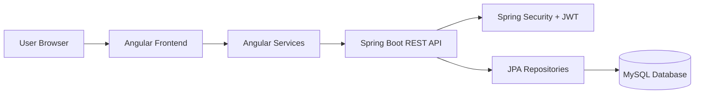
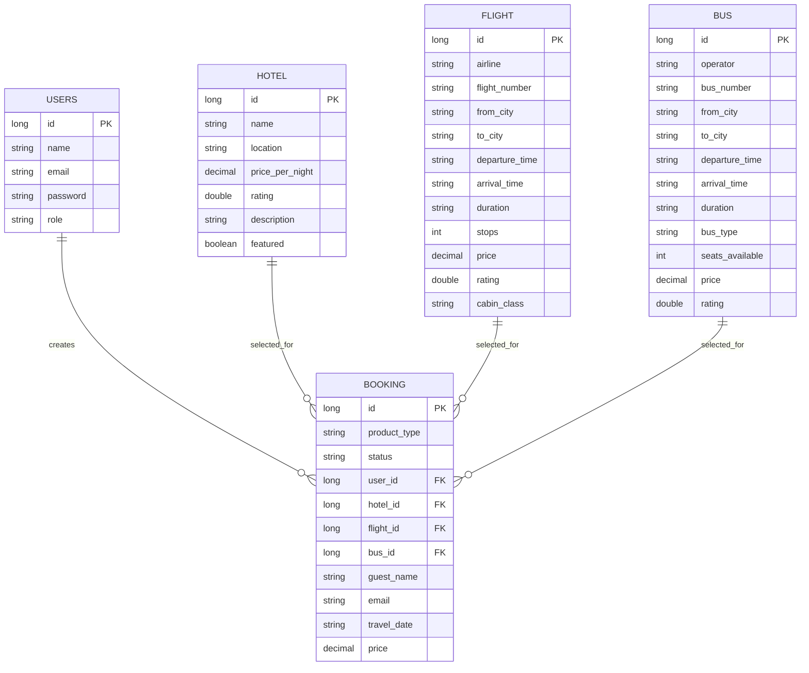
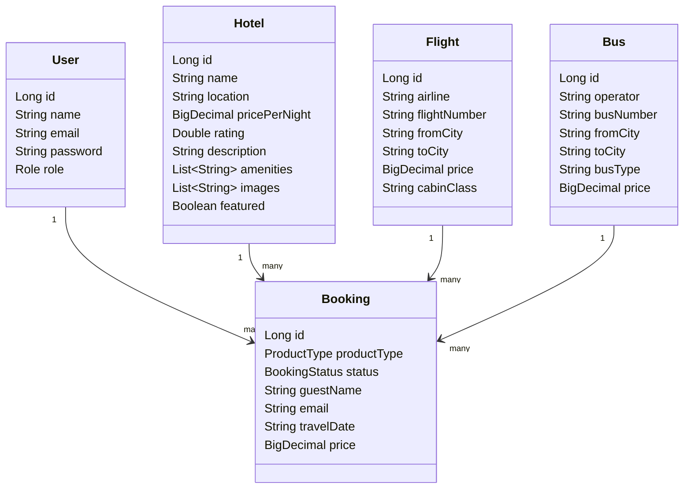
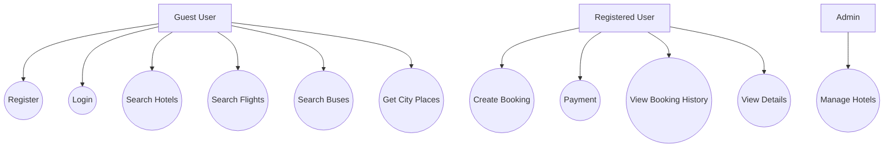
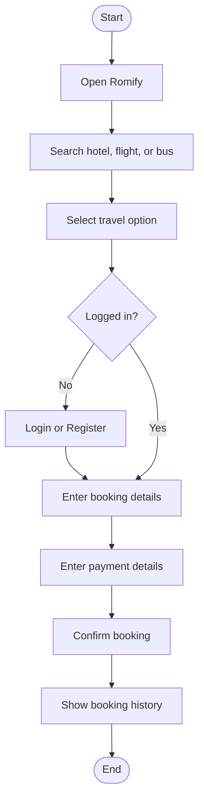
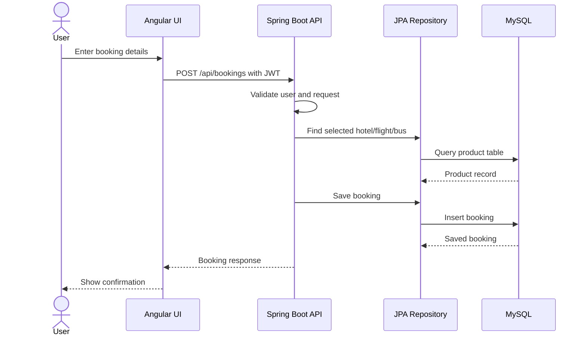
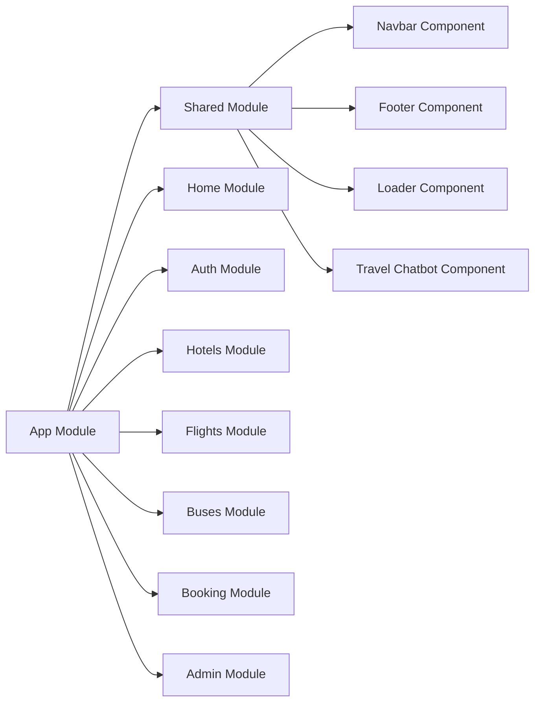
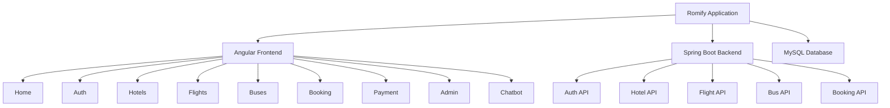

# Project Report: Romify Travel Booking System

## Title Page

**Project Title:** Romify Travel Booking System  
**Project Type:** Web Application  
**Submitted By:** [Student Name]  
**Roll Number:** [Roll Number]  
**Course:** [Course Name]  
**Department:** [Department Name]  
**College:** [College Name]  
**Academic Year:** [Academic Year]  
**Company / Organization:** [Company Name]  
**Project Guide:** [Guide Name]  
**Technology Used:** Angular, Spring Boot, MySQL

---

## Certificate from College

This is to certify that **[Student Name]**, student of **[College Name]**, has successfully completed the project titled **"Romify Travel Booking System"** in partial fulfillment of the requirements for **[Course Name]** during the academic year **[Academic Year]**.

The work carried out by the student is original and has been completed under the guidance of **[Guide Name]**.

**Place:** [City]  
**Date:** [Date]

**Project Guide**: ____________________  
**Head of Department**: ____________________  
**Principal**: ____________________

---

## Certificate from Company

This is to certify that **[Student Name]** has completed the project titled **"Romify Travel Booking System"** at **[Company Name]** during the period **[Start Date] to [End Date]**.

The student has worked on the design and development of a travel booking web application that provides hotel, flight, bus booking, authentication, admin management, booking history, payment workflow, and city place suggestion chatbot features.

**Company Mentor**: ____________________  
**Designation**: ____________________  
**Company Seal**: ____________________  
**Date**: ____________________

---

## Acknowledgement

I express my sincere gratitude to **[College Name]**, **[Department Name]**, and my project guide **[Guide Name]** for their valuable support and guidance throughout the development of this project.

I am also thankful to **[Company Name]** and my company mentor **[Mentor Name]** for providing an opportunity to work on this project and for giving practical guidance during implementation.

Finally, I thank my friends, teachers, and family members for their encouragement and support.

---

## Introduction

Romify is a travel booking web application designed to help users search and book hotels, flights, and buses from one platform. The system also provides authentication, booking history, payment flow, admin management, and a city guide chatbot that suggests popular places when a user enters a city name.

The application is built using Angular for the frontend, Spring Boot for the backend REST API, and MySQL as the database. It follows a modular structure so that each feature, such as hotels, flights, buses, booking, authentication, and administration, can be maintained independently.

---

## Company Profile

**[Company Name]** is an organization that provides software development and technology-based solutions. The company focuses on building reliable, user-friendly, and scalable applications for real-world business needs.

For this project, the company acted as the development and guidance organization for the Romify travel booking system.

---

## Problem Statement

Travellers often need to use multiple platforms to search hotels, flights, buses, and travel-related information. This increases effort, causes confusion, and makes booking management difficult.

The problem is to develop a single travel booking system where users can search hotels, flights, and buses, create bookings, make payment entries, view previous bookings, and get quick place suggestions for selected cities.

---

## Existing System and Need for the System

In an existing manual or semi-digital travel booking process, users may need to contact agents or visit separate websites for different services. Booking details may be scattered across different systems, and users may not have one place to view their travel history.

**Limitations of Existing System:**

- Separate platforms for hotel, flight, and bus booking.
- Time-consuming comparison of travel options.
- No centralized booking history.
- Manual dependency on agents for basic travel suggestions.
- Difficult administration of hotel, flight, and bus records.

**Need for Proposed System:**

- A single platform for multiple travel services.
- Faster search and booking experience.
- Secure login and user-specific booking history.
- Admin panel for managing travel inventory.
- Chatbot support for city-based place suggestions.

---

## Scope of the Proposed System

The proposed Romify system covers:

- User registration and login.
- Hotel search, listing, detail view, and booking.
- Flight search, listing, and booking.
- Bus search, listing, and booking.
- Booking history for logged-in users.
- Payment form workflow.
- Admin dashboard for managing hotel records.
- REST APIs for hotels, flights, buses, bookings, and authentication.
- City place suggestion chatbot.

The system is suitable for a travel booking MVP and can be enhanced for real payment gateway integration, live inventory, notifications, and advanced analytics.

---

## Objectives of the Proposed System

- To provide a user-friendly travel booking platform.
- To allow users to search hotels, flights, and buses.
- To manage authentication using JWT-based security.
- To store booking and product data in MySQL.
- To provide booking history for registered users.
- To allow admin users to manage travel inventory.
- To suggest popular places through a chatbot based on city name.
- To create a modular and maintainable application architecture.

---

## Operating Environment - Hardware and Software

### Hardware Requirements

| Component | Minimum Requirement |
|---|---|
| Processor | Intel i3 or equivalent |
| RAM | 4 GB |
| Storage | 2 GB free space |
| Network | Internet / Local network |
| Display | 1366 x 768 resolution |

### Software Requirements

| Software | Version / Use |
|---|---|
| Operating System | Windows / Linux / macOS |
| Frontend | Angular 21 |
| Backend | Spring Boot 3.4.5 |
| Programming Languages | TypeScript, Java 17 |
| Database | MySQL |
| Build Tools | Angular CLI, Maven |
| Runtime | Node.js, JDK 17 |
| IDE | Visual Studio Code / IntelliJ IDEA |
| API Testing | Postman / Browser DevTools |

---

## Brief Description of Technology Used

**Angular:** Used to build the single-page frontend application with modules, components, forms, routing, and services.

**Spring Boot:** Used to build REST APIs for authentication, hotels, flights, buses, and bookings.

**MySQL:** Used as the relational database for users, travel products, and bookings.

**Spring Security and JWT:** Used for secure login and protected APIs.

**Hibernate / JPA:** Used for object-relational mapping between Java entities and database tables.

**SCSS:** Used for styling frontend components.

---

## System Analysis and Design

The Romify system is divided into frontend, backend, and database layers. Users interact with Angular screens. Angular services call Spring Boot REST APIs. The backend validates data, applies security rules, performs business logic, and stores data in MySQL.

The main actors are:

- Guest User
- Registered User
- Admin

The main modules are:

- Authentication Module
- Hotel Module
- Flight Module
- Bus Module
- Booking Module
- Payment Module
- Admin Module
- Chatbot Module

---

## System Requirements

### Functional Requirements

| ID | Requirement |
|---|---|
| FR-01 | The system shall allow users to register with name, email, and password. |
| FR-02 | The system shall allow users to log in using email and password. |
| FR-03 | The system shall display hotels with filtering by location, rating, price, and sorting. |
| FR-04 | The system shall display flights with filtering by source, destination, class, price, and sorting. |
| FR-05 | The system shall display buses with filtering by source, destination, bus type, price, and sorting. |
| FR-06 | The system shall allow authenticated users to create bookings. |
| FR-07 | The system shall allow users to view their booking history. |
| FR-08 | The system shall provide a payment screen for booking confirmation workflow. |
| FR-09 | The system shall allow admin users to add, update, and delete hotel records. |
| FR-10 | The chatbot shall accept a city name and display popular places. |

### Non-Functional Requirements

| ID | Requirement |
|---|---|
| NFR-01 | The user interface should be responsive. |
| NFR-02 | APIs should return proper HTTP status codes. |
| NFR-03 | Passwords should be stored in encrypted form. |
| NFR-04 | Protected APIs should require JWT authentication. |
| NFR-05 | The system should be modular and maintainable. |
| NFR-06 | Form validation should prevent invalid user input. |
| NFR-07 | The system should be easy to deploy in a local environment. |

---

## Feasibility Study

### Technical Feasibility

The project is technically feasible because it uses widely available technologies such as Angular, Spring Boot, Java, and MySQL. These technologies support modular development, REST APIs, and secure authentication.

### Economic Feasibility

The project is economically feasible because the tools used are open-source or free for development. The system can be developed and deployed locally with minimum hardware cost.

### Operational Feasibility

The system is operationally feasible because users can easily search, book, and view travel services through a simple web interface. Admin users can manage records without directly accessing the database.

---

## Architecture Design



**Architecture Layers:**

- Presentation Layer: Angular components and pages.
- Service Layer: Angular services and Spring Boot controllers.
- Security Layer: JWT authentication and authorization.
- Data Access Layer: Spring Data JPA repositories.
- Database Layer: MySQL tables.

---

## Entity Relationship Diagram



---

## Class Diagram



---

## Use Case Diagrams



---

## Activity Diagram



---

## Sequence Diagram



---

## Component Diagram



---

## Module Hierarchy Diagram



---

## Table Design

### users

| Field | Type | Constraint | Description |
|---|---|---|---|
| id | BIGINT | Primary Key | User ID |
| name | VARCHAR | Not Null | User full name |
| email | VARCHAR | Unique, Not Null | User email |
| password | VARCHAR | Not Null | Encrypted password |
| role | VARCHAR | Not Null | USER or ADMIN |

### hotel

| Field | Type | Constraint | Description |
|---|---|---|---|
| id | BIGINT | Primary Key | Hotel ID |
| name | VARCHAR | Not Null | Hotel name |
| location | VARCHAR | Not Null | Hotel location |
| price_per_night | DECIMAL | Positive | Room price |
| rating | DOUBLE | Optional | Hotel rating |
| description | VARCHAR | Optional | Hotel description |
| featured | BOOLEAN | Default false | Featured hotel flag |

### flight

| Field | Type | Constraint | Description |
|---|---|---|---|
| id | BIGINT | Primary Key | Flight ID |
| airline | VARCHAR | Not Null | Airline name |
| flight_number | VARCHAR | Not Null | Flight number |
| from_city | VARCHAR | Not Null | Source city |
| to_city | VARCHAR | Not Null | Destination city |
| departure_time | VARCHAR | Optional | Departure time |
| arrival_time | VARCHAR | Optional | Arrival time |
| duration | VARCHAR | Optional | Duration |
| stops | INT | Default 0 | Number of stops |
| price | DECIMAL | Positive | Ticket price |
| rating | DOUBLE | Optional | Flight rating |
| cabin_class | VARCHAR | Optional | Economy, Business, etc. |

### bus

| Field | Type | Constraint | Description |
|---|---|---|---|
| id | BIGINT | Primary Key | Bus ID |
| operator | VARCHAR | Not Null | Bus operator |
| bus_number | VARCHAR | Not Null | Bus number |
| from_city | VARCHAR | Not Null | Source city |
| to_city | VARCHAR | Not Null | Destination city |
| departure_time | VARCHAR | Optional | Departure time |
| arrival_time | VARCHAR | Optional | Arrival time |
| duration | VARCHAR | Optional | Travel duration |
| bus_type | VARCHAR | Optional | AC Sleeper, Volvo, etc. |
| seats_available | INT | Optional | Available seats |
| price | DECIMAL | Positive | Ticket price |
| rating | DOUBLE | Optional | Bus rating |

### booking

| Field | Type | Constraint | Description |
|---|---|---|---|
| id | BIGINT | Primary Key | Booking ID |
| product_type | VARCHAR | Enum | HOTEL, FLIGHT, BUS |
| status | VARCHAR | Enum | CONFIRMED, PENDING, CANCELLED |
| user_id | BIGINT | Foreign Key | User who created booking |
| hotel_id | BIGINT | Foreign Key | Selected hotel |
| flight_id | BIGINT | Foreign Key | Selected flight |
| bus_id | BIGINT | Foreign Key | Selected bus |
| guest_name | VARCHAR | Not Null | Passenger or guest name |
| email | VARCHAR | Email | Contact email |
| check_in | VARCHAR | Optional | Hotel check-in |
| check_out | VARCHAR | Optional | Hotel check-out |
| departure_date | VARCHAR | Optional | Travel departure date |
| return_date | VARCHAR | Optional | Return date |
| guests | INT | Optional | Number of guests |
| passengers | INT | Optional | Number of passengers |
| title | VARCHAR | Optional | Booking title |
| route | VARCHAR | Optional | Route or location |
| travel_date | VARCHAR | Optional | Travel date |
| price | DECIMAL | Optional | Booking amount |

---

## Data Dictionary

| Term | Meaning |
|---|---|
| User | A registered customer or admin of the system. |
| Hotel | A stay option available for booking. |
| Flight | A flight option available for booking. |
| Bus | A bus option available for booking. |
| Booking | A confirmed travel reservation made by a user. |
| Product Type | Category of booking: hotel, flight, or bus. |
| JWT | JSON Web Token used for secure API access. |
| Admin | A privileged user who can manage records. |
| Chatbot | A UI assistant that suggests places based on city name. |

---

## Implementation

The system is implemented as a full-stack web application.

**Frontend Implementation:**

- Angular modules are used for feature separation.
- Components are used for pages such as home, hotel list, flight list, bus list, booking, payment, and admin dashboard.
- Services communicate with REST APIs using HTTP client.
- JWT interceptor attaches authentication token to protected API requests.
- Shared components include navbar, footer, loader, hotel card, and chatbot.

**Backend Implementation:**

- Spring Boot exposes REST APIs.
- Controllers handle requests and responses.
- JPA repositories perform database operations.
- Entity classes map Java objects to database tables.
- Spring Security handles authentication and authorization.
- JWT service generates and validates tokens.

---

## Input Screens

Screens should be inserted in the final Word/PDF report with valid data. Suggested screenshots:

| Screen | Sample Valid Data |
|---|---|
| Register | Name: Vishwajeet, Email: jeet@example.com, Password: Jeet@123 |
| Login | Email: jeet@example.com, Password: Jeet@123 |
| Hotel Search | Location: Goa, Check-in: 2026-06-10, Check-out: 2026-06-12 |
| Flight Search | From: Delhi, To: Goa, Date: 2026-06-10 |
| Bus Search | From: Bengaluru, To: Goa, Date: 2026-06-10 |
| Booking Form | Guest: Vishwajeet, Email: jeet@example.com, Guests: 2 |
| Payment Form | Card Holder: Vishwajeet, Card Number: 4111111111111111 |
| Chatbot | City: Pune |

---

## Output Screens / Reports

All reports should contain at least 5 valid records in the final document.

### Sample Hotel Report

| Sr. No. | Hotel Name | Location | Price | Rating |
|---|---|---|---|---|
| 1 | Azure Bay Resort | Goa | 5499 | 4.7 |
| 2 | Himalayan Cedar Retreat | Manali | 4299 | 4.6 |
| 3 | The Metro Grand | Mumbai | 3899 | 4.4 |
| 4 | Lakefront Palace | Udaipur | 6199 | 4.8 |
| 5 | City Comfort Inn | Pune | 2999 | 4.2 |

### Sample Booking Report

| Booking ID | User | Product | Route / Location | Travel Date | Amount | Status |
|---|---|---|---|---|---|---|
| 1 | Vishwajeet | HOTEL | Goa | 2026-06-10 | 5499 | CONFIRMED |
| 2 | Aarav | FLIGHT | Delhi to Goa | 2026-06-15 | 6200 | CONFIRMED |
| 3 | Priya | BUS | Bengaluru to Goa | 2026-06-20 | 1450 | CONFIRMED |
| 4 | Neha | HOTEL | Manali | 2026-07-01 | 4299 | CONFIRMED |
| 5 | Rohan | FLIGHT | Mumbai to Delhi | 2026-07-05 | 5100 | CONFIRMED |

---

## Sample Code

### Booking API Controller

```java
@PostMapping
@ResponseStatus(HttpStatus.CREATED)
public Booking createBooking(@Valid @RequestBody BookingRequest request, Principal principal) {
  var user = userRepository.findByEmail(principal.getName())
      .orElseThrow(() -> new ResponseStatusException(HttpStatus.UNAUTHORIZED, "User not found."));

  var booking = new Booking();
  booking.setUser(user);
  booking.setStatus(BookingStatus.CONFIRMED);
  booking.setGuestName(request.guestName());
  booking.setEmail(request.email());

  attachProduct(booking, request);
  return bookingRepository.save(booking);
}
```

### Chatbot City Matching

```typescript
private findGuide(city: string): CityGuide | undefined {
  const normalizedCity = this.normalize(city);
  return CITY_GUIDES.find((guide) =>
    guide.aliases.some((alias) => this.normalize(alias) === normalizedCity)
  );
}
```

---

## Testing

Testing was performed to verify frontend forms, backend APIs, authentication, booking workflow, and chatbot city suggestions.

---

## Test Strategy

- Unit-level checking of component methods and backend methods.
- Integration testing between Angular services and Spring Boot APIs.
- Form validation testing for invalid and valid inputs.
- Authentication testing for protected routes and APIs.
- Manual UI testing for responsive layout and user flow.

---

## Unit Test Plan

| Module | Test Focus |
|---|---|
| Auth | Register, login, duplicate email validation |
| Hotels | List, filter, detail, create/update/delete |
| Flights | List, filter, price sorting |
| Buses | List, filter, price sorting |
| Booking | Create booking and fetch booking history |
| Payment | Validate card and UPI input flow |
| Chatbot | City input, alias matching, fallback message |

---

## Acceptance of Test Plan

The test plan is accepted when:

- Users can register and log in successfully.
- Travel products are listed correctly.
- Search and filters return expected records.
- Authenticated users can create bookings.
- Booking history shows user-specific bookings.
- Admin can manage records.
- Chatbot returns places for supported cities.
- Build completes without errors.

---

## Test Cases

| Test Case ID | Scenario | Input | Expected Result | Status |
|---|---|---|---|---|
| TC-01 | User registration | Valid name, email, password | Account is created | Pass |
| TC-02 | User login | Valid credentials | JWT token is generated | Pass |
| TC-03 | Duplicate registration | Existing email | Error message is shown | Pass |
| TC-04 | Hotel search | Location: Goa | Goa hotels are displayed | Pass |
| TC-05 | Flight search | From: Delhi, To: Goa | Matching flights are displayed | Pass |
| TC-06 | Bus search | From: Bengaluru, To: Goa | Matching buses are displayed | Pass |
| TC-07 | Booking creation | Valid booking form | Booking is confirmed | Pass |
| TC-08 | Booking history | Logged-in user | User bookings are shown | Pass |
| TC-09 | Admin hotel update | Valid hotel data | Hotel record is updated | Pass |
| TC-10 | Chatbot city search | Pune | Popular Pune places are shown | Pass |
| TC-11 | Chatbot alias search | Hydrabad | Hyderabad places are shown | Pass |
| TC-12 | Unknown chatbot city | Random city | Fallback message is shown | Pass |

---

## Results

The Romify application successfully provides travel search and booking functionality. Users can register, log in, search hotels, flights, and buses, create bookings, view booking history, and use the chatbot for city place suggestions. The Angular production build is successful.

---

## Conclusion

The Romify Travel Booking System fulfills the objective of creating a centralized platform for travel booking services. It improves user convenience by combining hotels, flights, buses, booking history, payment workflow, and city guide assistance into one web application.

---

## Summary / Conclusion

This project demonstrates full-stack application development using Angular, Spring Boot, and MySQL. It includes modular frontend design, REST API development, JWT-based authentication, database integration, and a practical chatbot feature.

---

## Limitations of the System

- Payment gateway is implemented as a workflow screen, not a real payment integration.
- Travel inventory is seeded/static and not connected to live suppliers.
- Chatbot uses predefined city data and does not call an external AI or tourism API.
- Admin management is mainly focused on hotel records.
- No email or SMS notification is currently implemented.

---

## Future Enhancements

- Integrate real payment gateway such as Razorpay or Stripe.
- Add live hotel, flight, and bus APIs.
- Add cancellation and refund workflow.
- Add email and SMS booking notifications.
- Add advanced admin dashboard with analytics.
- Add AI-based chatbot with dynamic tourism information.
- Add reviews and ratings from users.
- Add multi-language support.
- Add PDF invoice generation.

---

## References / Bibliography

- Angular Documentation: https://angular.dev/
- Spring Boot Documentation: https://spring.io/projects/spring-boot
- Spring Security Documentation: https://spring.io/projects/spring-security
- MySQL Documentation: https://dev.mysql.com/doc/
- Hibernate ORM Documentation: https://hibernate.org/orm/documentation/
- MDN Web Docs: https://developer.mozilla.org/

---

## Appendices

The appendices contain additional screens, progress tracking, and supporting project information.

---

## Annexure I - Additional Input and Output Screens

Suggested screenshots to include:

- Home page with search panel.
- Hotel listing page with at least 5 records.
- Hotel detail page.
- Flight listing page with at least 5 records.
- Bus listing page with at least 5 records.
- Booking form with valid user data.
- Payment page with valid sample data.
- Booking history page with at least 5 records.
- Admin dashboard.
- Chatbot showing places for Pune, Mumbai, Nagpur, Ahmedabad, Nashik, Satara, Kolhapur, and Hyderabad.

---

## Annexure II - Progress Sheet

| Week | Work Completed | Guide Remark | Signature |
|---|---|---|---|
| Week 1 | Requirement gathering and project planning |  |  |
| Week 2 | Frontend layout and routing setup |  |  |
| Week 3 | Backend API and database setup |  |  |
| Week 4 | Authentication and JWT security |  |  |
| Week 5 | Hotel, flight, and bus modules |  |  |
| Week 6 | Booking and payment workflow |  |  |
| Week 7 | Admin dashboard and chatbot |  |  |
| Week 8 | Testing, build verification, and report preparation |  |  |
